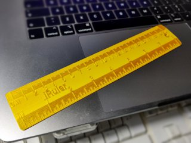
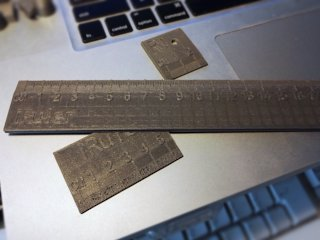
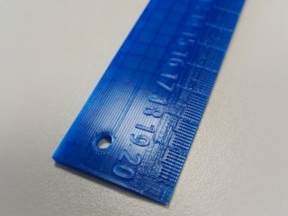

# iRuler customizable ruler
*3D printable customizable ruler in centimeters, inches, or both (formerly thing:1902359)*

### License
[Creative Commons - Attribution - Share Alike](https://creativecommons.org/licenses/by-sa/4.0/)

### Attribution
This is a remix of stu121's customizable ruler ([Thingiverse thing:109739](https://www.thingiverse.com/thing:109739)).

### Gallery

[🔎](images/photo1.jpg) [🔎](images/photo2.jpg) [🔎](images/photo3.jpg)

## Description and Instructions

Did you ever have an acute need for a custom ruler that is exactly two centimeters long? Or does everyone keep on stealing your rulers because there is no permanent way to tag them? This customizable iRuler with will solve all your problems!

This is a remix of [stu121's customizable ruler](https://www.thingiverse.com/thing:109739). It has a refined design, and more customizable options:
* Available in either centimeters or inches, or both.
* The subdivision lines are now recessed, which makes them more printable on an average FDM printer.
* Text and numbers can be embossed or recessed by using a positive, respectively negative height. A height of 0 omits text or numbers. You can even have the text cut all the way through, but this will leave you with loose bits for letters like ‘o’ and ‘B’.
* Optional hole.
* Configurable width.
* Optional rounded corners.
* The design can be flipped around to have the text facing either upward or downward.

### Creating a custom ruler

Open the `.scad` file in [OpenSCAD](https://www.openscad.org/) and **[use the OpenSCAD Customizer](https://www.dr-lex.be/3d-printing/customizer.html)** to create a model with your own desired specifications.

If the subdivision lines are set too narrow, they will fuse together and become invisible. You can do some tiny test prints with the ruler set to 2 cm or 1 inch to find a good setting, but the default should be OK for most printers.

If you want to give the subdivision lines a different color by changing filaments at a certain Z height, you must enable the ‘AllowZColorChange’ option. (Otherwise the lines follow the same slope as the ruler's edges, which looks nicer in a single-filament print, but does not allow a Z color change.)

Not all Unicode characters may work, although the usual Latin characters like ‘é’ should be directly usable in OpenSCAD without having to use escape codes. Non-European scripts can be usable if you change the font (you will have to do that in the code, there is no customizer option for this).

### Accuracy

If **accuracy** is important, you must consider the fact that most plastics will *shrink* when cooling down after printing. For ABS this can be very significant. To get a perfectly accurate ruler, you should scale up the 3D model in your slicing program or an external 3D model editor, by the inverse of the shrinkage factor.

To determine the shrinkage for your filament and print settings, first print a test piece with the exact same material and settings as you want to use for the ruler. Measure the actual distance between two known points on the printed object. I provide two calibration models that have notches 20 cm or 15 cm apart (7.874 or 5.906 inches). Do not rely on outside dimensions: for the calibration models, measure between the tips of the small triangles, the expected distance is either 200 mm or 150 mm. Calculate the scale factor as the expected length divided by the measured length, and use this factor to scale up the model before printing it.

For instance for the silky gold PLA of the first photo, I noticed about 0.5mm shrinkage across 20 cm, hence I had to upscale the ruler to 100.25% to make it accurate.

### Hints for Printing

A layer height of 0.1 is recommended for the details to be well printed. If you can, set perimeter width as narrow as possible (i.e., 0.4 for a 0.4 mm nozzle).

## Updates

### 2016/11/19
First publication on Thingiverse.

### 2017/04/21
Added inches option which has subdivisions down to 1/16th.

### 2021/12/12
Migrated to GitHub, added option for combined cm and inches, and rounded corners.

### 2024/12/19
Added `AllowZColorChange` option.

## TAGS
`centimeter`, `centimeters`, `customizer`, `imperial`, `inch`, `inches`, `metric`, `millimeter`, `millimeters`, `openscad`, `ruler`, `Ruler_in_Centimeters`, `writescad`
